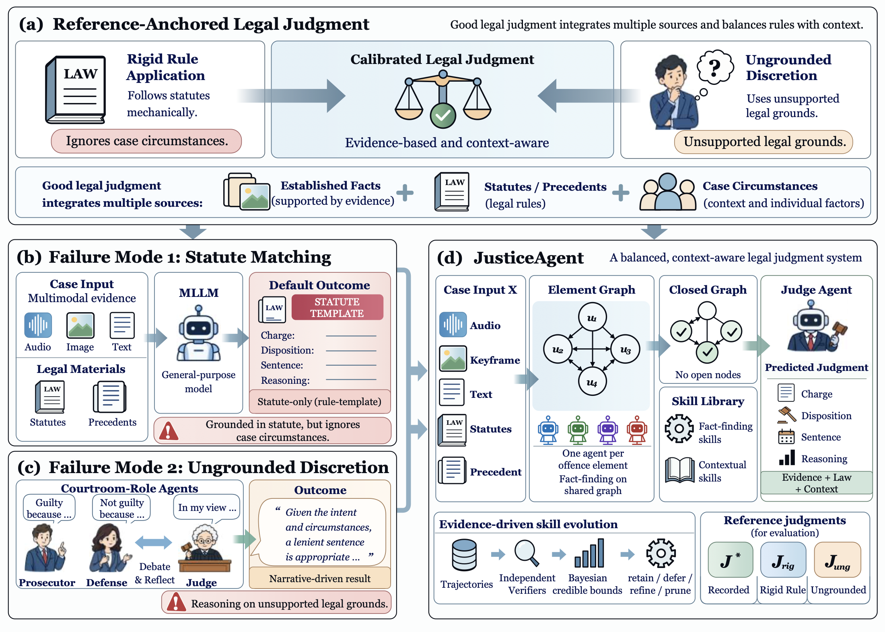
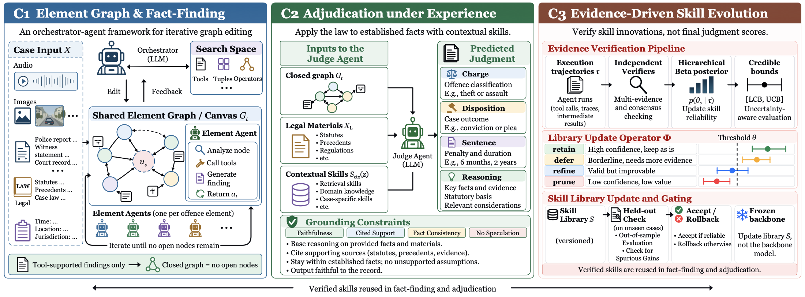

<h1 align="center">JusticeAxis</h1>

<p align="center">
  <b>Benchmarking Legal Judgment between Rigid Rule Application and Ungrounded Discretion</b>
</p>

<p align="center">
  <a href="https://arxiv.org/abs/2610.00353"></a>
  <a href="https://huggingface.co/papers/2610.00353"></a>
  <a href="https://huggingface.co/datasets/beita6969/justiceaxis-256"></a>
</p>

JusticeAxis is a benchmark of **256 real-world criminal cases from 18 countries** with audio, image and text
evidence. A system reads the case and produces one judgment: the charge, the disposition, the sentence, and the
reasoning. Every task has **three reference judgments**, so a judgment can be located by which
reference it lands closest to: leaning on the statute alone, or arguing from grounds the record does not support.

This repository holds the project documentation and a loading example. The data lives on Hugging Face:
[`beita6969/justiceaxis-256`](https://huggingface.co/datasets/beita6969/justiceaxis-256) (case inputs and media, about 19 GB).

<p align="center">
  
</p>

<p align="center"><i>
Figure 1 of the paper. The axis a judgment sits on (a), the two failure modes of existing systems, rigid statute
matching (b) and ungrounded discretion (c), and the JusticeAgent framework (d).
</i></p>

## Contents

[Task](#the-task) · [References and metrics](#references-and-metrics) · [Results](#results-in-the-paper) ·
[JusticeAgent](#justiceagent) · [Data](#the-data) · [Quick start](#quick-start) · [Citation](#citation)

## The task

The input is `X = {X_m : m in M}` with `M` a subset of `{A, I, T, L}`:

- `A`: audio,
- `I`: keyframes,
- `T`: text evidence together with the background of the case,
- `L`: the candidate statutes and the comparable precedents the charge turns on.

Missing modalities are allowed. Given `X`, a system generates a judgment `J = (c, d, s, r)`: the charge, the
disposition, the sentence, and the reasoning that cites what it relies on. The recorded charge is never
supplied, so a system must establish what happened before deciding which statute governs it.

## References and metrics

Each task has three reference judgments:

| Reference | What it is |
|---|---|
| Recorded judgment | The judgment as the court decided it. |
| Rigid-rule judgment | Applies the matched statute to the established facts regardless of circumstances. |
| Ungrounded-discretion judgment | Argues from the narrative on unsupported legal bases. |

**Metrics.**

- **Charge:** exact-match accuracy and charge-family accuracy.
- **Outcome:** disposition accuracy and exact-sentence accuracy, each also conditioned on the coarser decision being right.
- **Outcome distance:** `rho(J, J') = lambda_d * 1[d != d'] + lambda_s * |log(1+s) - log(1+s')| / log(1 + s_max)`, with `s_max` the longest sentence in the data.
- **Placement:** a judgment is placed at the reference it lands closest to under `rho`.
- **Polarity:** `Pol = (#rigid - #discretion) / #(not the recorded judgment)`, in [-1, 1]. `+1` means reciting the statute, `-1` means arguing from unsupported grounds.

Anchoring compares outcomes. How a judgment is argued is constrained rather than scored, so fluency earns no credit.

## Results in the paper

Fourteen systems are evaluated on **128 evaluation cases** under one protocol: the evaluation package stays closed,
retrieval runs over the provided `X_L` with no network lookup, every model receives the same `X`, and audio-less
backbones receive its written description. Acc and Sent. are the shares of cases with the charge and the sentence
exactly correct, Avg is the mean of Acc, Fam, Disp and Sent., and "Recorded" is the share of judgments landing
closest to the recorded judgment. Values are copied from Table 2 of the paper, which also gives Wilson 95% intervals.

| System | Acc | Sent. | Avg | Recorded (%) | Pol |
|---|---:|---:|---:|---:|---:|
| *Open-weight* | | | | | |
| Qwen3.8-27B | 47.66 | 28.91 | 48.83 | 54.69 | -0.345 |
| Gemma 4 31B | 32.81 | 17.97 | 32.03 | 34.38 | -0.381 |
| DeepSeek-V4-Flash (304B mixture-of-experts) | 59.38 | 36.72 | 58.40 | 66.41 | -0.302 |
| *Commercial* | | | | | |
| Claude Sonnet 5 | 78.12 | 67.97 | 78.52 | 84.38 | 0.500 |
| Gemini 3.8 Flash | 82.81 | 74.22 | 84.38 | 90.62 | 0.167 |
| Grok 4.6 | 79.69 | 75.78 | 83.20 | 89.84 | 0.538 |
| GPT-5.6 | 89.06 | 85.16 | 91.02 | 93.75 | 0.750 |
| *Peer frameworks on Qwen3.8-27B* | | | | | |
| Syllogism prompting | 56.25 | 39.84 | 57.42 | 67.97 | 0.122 |
| Syllogistic retrieval | 67.19 | 55.47 | 68.75 | 77.34 | 0.241 |
| Agentic legal search | 67.97 | 57.81 | 71.48 | 80.47 | 0.840 |
| Element agents | 73.44 | 68.75 | 76.76 | 82.03 | 0.652 |
| Courtroom simulation | 64.06 | 58.59 | 70.12 | 78.12 | 0.500 |
| Multimodal agents | 74.22 | 64.06 | 74.80 | 78.91 | 0.259 |
| **JusticeAgent** (Qwen3.8-27B) | 78.91 | 70.31 | 80.86 | 85.16 | 0.263 |

What the paper reports:

- **Failure turns direction with scale.** The three open-weight backbones have negative `Pol` (arguing from grounds the record does not support). Every commercial model and every peer framework has positive `Pol` (returning the statutory default).
- **The axis tracks competence.** Placement and charge accuracy rank-correlate at 0.98 over the fourteen systems.
- **The recording matters most.** Replacing the audio by its written description costs 24.0 points of Avg, more than twice any other component in the ablation.

## JusticeAgent

JusticeAgent is a harness around a frozen backbone. One element agent per element of the offence establishes the
facts on a shared graph, the Element Graph, whose nodes are the elements required by the legal materials. A judge
agent then applies the law in syllogistic form under *contextual skills* that carry experience of the
circumstances. Skills are distilled from execution trajectories and admitted only under Bayesian credible bounds.
On its own backbone it raises Acc from 47.66 to 78.91 and `Pol` from -0.345 to +0.263.

<p align="center">
  
</p>

<p align="center"><i>
Figure 2 of the paper. C1: an orchestrator edits a shared Element Graph while one agent per offence element calls
tools and returns findings until no node is open. C2: the judge applies the law to the closed graph under
contextual skills and grounding constraints. C3: skills mined from trajectories are verified independently and
retained, deferred, refined or pruned on credible bounds, not on judgment scores.
</i></p>

## The data

| | |
|---|---|
| Task rows | 258 (130 original tasks from 128 cases, and 128 added cases) |
| Cases | 256 |
| Modalities | 255 tasks with text, images and audio; 3 with text and images only |
| Images | 1,441 files (919 PNG, 517 JPG, 5 JPEG) |
| Audio | 435 files (311 WAV, 124 FLAC), no transcripts |
| Reference records | 258 rows, each with the three references |
| Language | English inputs; the failure references and the summaries are in Chinese |
| Split | none |

The paper reports results on 128 evaluation cases. The release does not say which cases those are; `cohort` only separates
the original 128 cases from the 128 added later.

**Notes on the data.**

- In sentencing and appeal tasks the earlier conviction or plea is part of the input, so the charge is not always withheld.
- `sentencing_framework` lists up to two Sentencing Council guideline pages (with a quote and the sha256 of the page text) for most of the added cases.
- Audio has no transcripts: it is shipped as the original clips with written descriptions and stated limits.
- Statutes are included in full, which is why each case input is large.

Field-by-field description of both files: [docs/data_format.md](docs/data_format.md).

## Quick start

```bash
pip install datasets huggingface_hub
python examples/load_justiceaxis.py --case JAV200-002 --images-only
```

```python
import json
from datasets import load_dataset

inputs = load_dataset("beita6969/justiceaxis-256", "default", split="train")
refs = load_dataset("beita6969/justiceaxis-256", "references", split="train")
task = inputs[0]
reference = next(r for r in refs if r["record_id"] == task["record_id"])
print(task["record_id"], json.loads(task["input_json"])["task"]["instruction"][:80])
print(reference["available"], reference["recorded"]["outcome"] if reference["available"] else None)
```

## Evaluation

The metrics of the paper (charge and family accuracy, disposition and sentence accuracy, the conditional accuracies, the
outcome distance and nearest anchor, and Pol) are implemented in [`justiceaxis_eval`](justiceaxis_eval):

```bash
python -m justiceaxis_eval --template predictions.jsonl     # one row per task
python -m justiceaxis_eval --predictions predictions.jsonl --out report.json
```

Details, the prediction format and the tie rules are in [docs/evaluation.md](docs/evaluation.md).

## Repository layout

```
README.md
LICENSE                          MIT license for the code and documentation
CITATION.cff
assets/                          figures from the paper
docs/data_format.md              fields and structure of a case record
examples/load_justiceaxis.py     load the dataset and fetch one case's media
examples/predictions_example.jsonl   example predictions for the evaluation code
justiceaxis_eval/                evaluation metrics of the paper
tests/test_metrics.py            checks of the metric arithmetic
docs/evaluation.md               prediction format, metrics and tie rules
```

## Scope and limitations

From the paper: the benchmark is retrospective and criminal only, and the harness is decision support, not a court.

## Citation

```bibtex
@misc{tu2026justiceaxis,
  title         = {JusticeAxis: Benchmarking Legal Judgment between Rigid Rule Application and Ungrounded Discretion},
  author        = {Tu, Zhengkai and Zhang, Mingda and Wang, Zijia and Tang, Xiaoying and Huang, Jimmy},
  year          = {2026},
  eprint        = {2610.00353},
  archivePrefix = {arXiv},
  url           = {https://arxiv.org/abs/2610.00353}
}
```

GitHub's "Cite this repository" button reads [CITATION.cff](CITATION.cff).

## License

The code and documentation in this repository are released under the [MIT License](LICENSE).

The **dataset is not covered by this license.** It is released under the custom terms on the
[Hugging Face dataset card](https://huggingface.co/datasets/beita6969/justiceaxis-256).
